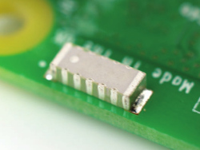

قبل ربط أي لوح HAT بالـ Raspberry Pi الخاص بك، تأكد من إيقاف تشغيل Pi.

+ قم بإزالة لوحة Sense HAT والاجزاء الاخرى من العبوة الخاصة بها.

+ استخدم اثنين من البراغي المرفقة لربط الفواصل مع جهاز Raspberry Pi الخاص بك، كما هو موضح أدناه.

**ملاحظة:** الخطوة أعلاه اختيارية – ليس عليك ان تربط قطع التثبيت بلوحة Sense HAT لكي تعمل.

+ ثم ادفع Sense HAT بعناية على دبابيس Raspberry Pi ، وثبته بالبراغي المتبقية.

** ملاحظة: ** سيؤدي استخدام قطع التثبيت المعدنية بجوار الهوائي اللاسلكي الخاص بجهاز Raspberry Pi 3 الى تقليل أدائه ونطاقه. إما أن تترك قطع التثبيت هذه، أو تستخدم قطع التثبيت النايلون وبراغي النايلون بدلاً من ذلك.

** نصيحة احترافية: ** كن حذرًا عند خلع Sense HAT ، حيث يميل الرأس الأسود ذو 40 سنًا إلى التعثر اي يكون عالق.
