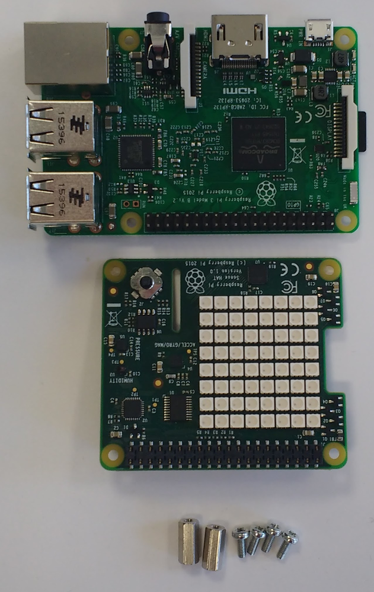

Bevor du einen HAT an deinem Raspberry Pi befestigst, stelle sicher, dass der Pi ausgeschaltet ist.

+ Entferne den Sense HAT und alle Teile aus ihrer Verpackung.

+ Verwende zwei der mitgelieferten Schrauben, um die Abstandshalter an deinem Raspberry Pi zu befestigen, wie unten gezeigt.

**Hinweis:** Der obige Schritt ist optional - du musst die Abstandshalter nicht am Sense HAT anbringen, damit er funktioniert.

+ Schiebe dann den Sense HAT vorsichtig auf die Pins deines Raspberry Pi und sichere ihn mit den restlichen Schrauben.

**Hinweis:** Die Verwendung eines Metallabstandshalters neben der Funkantenne des Raspberry Pi 3 beeinträchtigt dessen Leistung und Reichweite. Lass entweder ein wenig Abstand oder benutze stattdessen Abstandshalter und Schrauben aus Nylon.

**Profi-Tipp:** Sei vorsichtig, wenn du den Sense HAT abnimmst, da der 40-polige schwarze Header leicht hängen bleibt.
