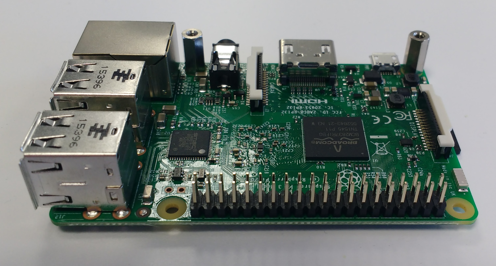
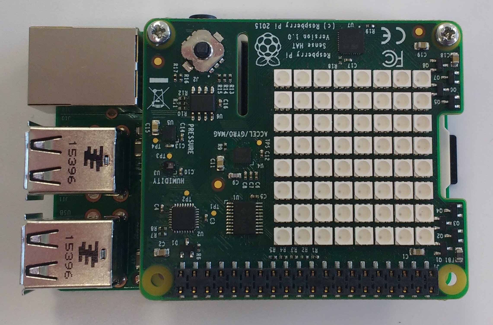

## Attaching a Sense HAT

1. Remove your Sense HAT and parts from their packaging.

	

2. Use two of the machine screws to attach the spacers to your Raspberry Pi as shown below.

	
	
3. Next push the Sense HAT carefully onto the pins of your Raspberry Pi, and secure it with the remaining machine screws.

	
