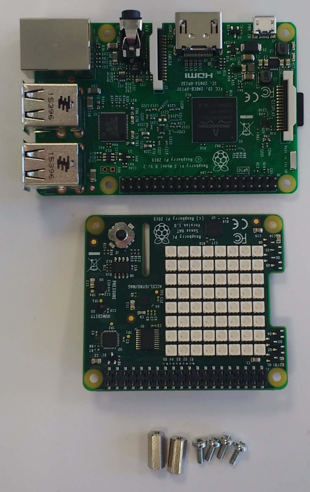

Before attaching any HAT to your Raspberry Pi, ensure that the Pi is shut down.

+ Remove the Sense HAT and parts from their packaging.

+ Use two of the provided screws to attach the spacers to your Raspberry Pi, as shown below.

+ Then push the Sense HAT carefully onto the pins of your Raspberry Pi, and secure it with the remaining screws.

**NOTE:** Using a metal stand-off next to the Raspberry Pi 3's wireless antenna will degrade its performance and range. Either leave out this stand-off, or use nylon stand-offs and nylon screws instead.

