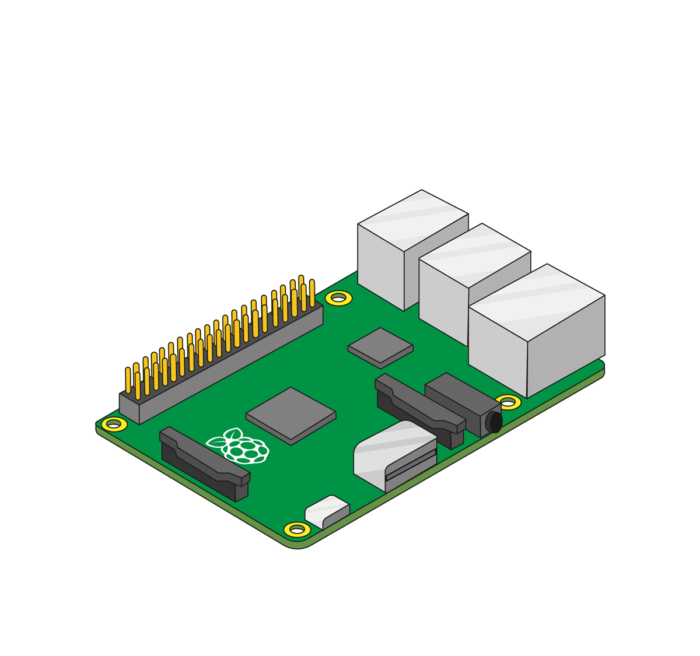

Antes de acoplar cualquier HAT a tu Raspberry Pi, asegúrate de que el Pi esté apagado.

+ Retira el Sense Hat y sus piezas del empaque.

+ Utiliza dos de los tornillos suministrados para fijar los espaciadores a tu Raspberry Pi, como se muestra en la imagen de abajo.

**Nota:** El paso de arriba es opcional — no tienes que acoplar los espaciadores al Sense Hat para que funcione.

+ Luego empuja el Sense Hat con cuidado hacia los pines de tu Raspberry Pi, y asegúralo con los tornillos restantes.

**Nota:** utilizar el separador metálico cerca de la antena inalámbrica Raspberry Pi 3 degradará su rendimiento y alcance. Puedes dejar de lado el separador o, en todo caso, utilizar el separador de nylon con los tornillos de nylon.

**Consejo profesional:** ten cuidado cuando retiras el Sense Hat, ya que el conector de 40-pines tiende a quedarse atascado.
