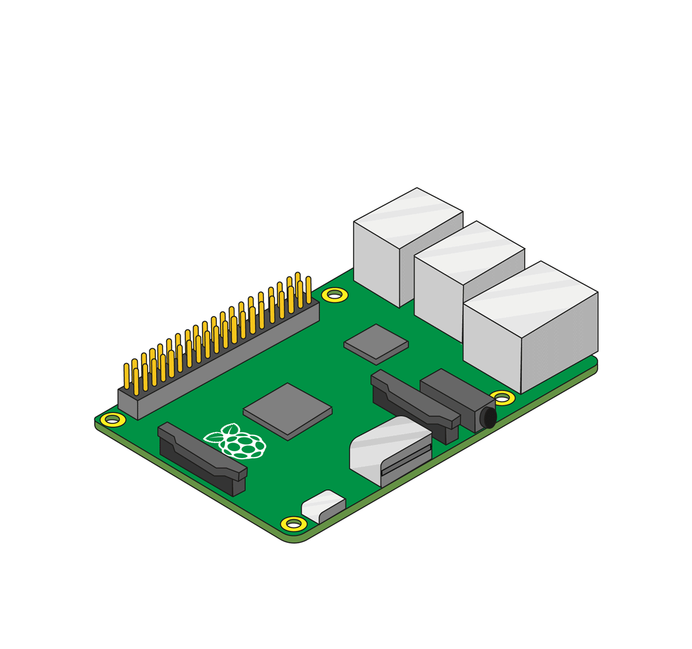

Przed dołączeniem jakiegokolwiek HAT do Raspberry Pi, upewnij się, że Pi jest odłączony od zasilania.

+ Wyjmij Sense HAT oraz akcesoria montażowa z opakowań.

+ Użyj dostarczonych śrub, aby przymocować dystanse do Raspberry Pi, jak pokazano poniżej.

**Uwaga:** powyższy krok jest opcjonalny - nie musisz dołączać dystansów, aby Sense HAT poprawnie funkcjonował.

+ Następnie ostrożnie wciśnij Sense HAT na piny Raspberry Pi i zabezpiecz pozostałymi śrubami.

**Uwaga:** użycie metalowych dystansów, obok anteny bezprzewodowej Raspberry Pi 3, obniży jej wydajność i zakres. Możesz pominąć ich montaż lub zastąpić je nylonowymi dystansami.

**Wskazówka:** przy zdejmowaniu Sense HAT należy zachować ostrożność, ponieważ 40-pinowe złącze ma tendencje do częstego zacinania się.
