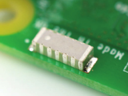

Antes de conectar qualquer HAT ao seu Raspberry Pi, verifique se o Pi está desligado.

+ Remova o Sense HAT e as partes de suas embalagens.

+ Use dois dos parafusos fornecidos para conectar os espaçadores ao seu Raspberry Pi, como mostrado abaixo.

**Nota:** a etapa acima é opcional — você não precisa anexar os espaçadores ao Sense HAT para que ele funcione.

+ Então empurre o Sense HAT cuidadosamente nos pinos do seu Raspberry Pi e prenda-o com os parafusos restantes.

**Nota:** o uso de um suporte metálico ao lado da antena de wireless do Raspberry Pi 3 prejudicará seu desempenho e alcance. Deixe estes espaçadores de lado ou use espaçadores e parafusos de nylon em vez disso.

**Dica profissional:** tenha cuidado ao tirar o Sense HAT, pois o conector de 40 pinos preto tende a ficar preso.
